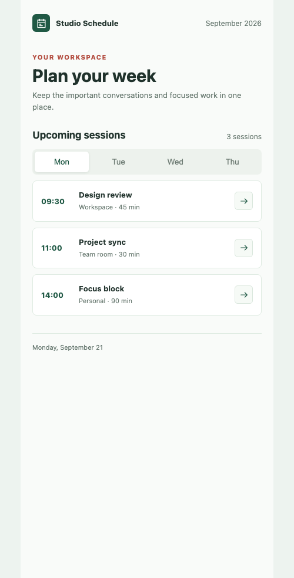

# Open Canvas

Local-first workspace for generating, organizing, annotating, and preparing AI-built mobile interfaces for Figma workflows.

当前版本：**1.23**（首个公开发行尚未完成验收）

Open Canvas 是独立的开源项目，并非 OpenAI 或 Figma 的官方产品或合作项目。项目采用 [Apache-2.0](LICENSE) 许可证；第三方声明见 [THIRD_PARTY_LICENSES.md](THIRD_PARTY_LICENSES.md)。

> **项目角色：开发/维护主版本。** 本目录用于维护 Open Canvas 宿主和生成页面工作流。开发维护边界记录在 [`DEVELOPMENT-MAINTENANCE.md`](DEVELOPMENT-MAINTENANCE.md)；只有打包给其他使用者的副本才执行 [`DISTRIBUTION-READONLY.md`](DISTRIBUTION-READONLY.md) 中的宿主只读策略。

> **自动化任务边界：** 分发包内的 `$ai-page-board` Skill 只修改生成页面，不修改宿主。该规则不限制任何人依据 Apache-2.0 修改、fork 或再分发项目源码，详见 [`DISTRIBUTION-READONLY.md`](DISTRIBUTION-READONLY.md)。

Open Canvas 是一个与 Codex 本地项目协同的 React 工作台，用来集中查看和管理由 Codex 生成的移动端界面。生成和文件写入在 Codex 客户端的项目任务中执行，浏览器只负责预览、管理与标注。



上图是仓库内可公开复现的 `Studio Schedule` 演示页，不包含第三方品牌、照片或受限素材。

## 适用场景

- 团队设计师通过 Codex 对话或 Skill 生成移动端页面。
- 需要一个可视化看板来比较多个页面方案、整理探索结果和评审队列。
- 需要在页面上做浏览器标注，再让 Codex 根据标注继续迭代。

页面创建入口由仓库级 `$ai-page-board` Skill 和本地 CLI 提供，画板本身不提供手工导入或新建页面按钮。

> **页面与宿主分离：** 生成页面的设计请求使用 `$ai-page-board` 修改 `generated-pages/`；明确的宿主源码维护请求由维护者或贡献者按正常开发流程处理。

## 功能

- 多个 Boards：可在左侧栏手动创建、重命名和删除 Board，并在 Boards 之间迁移页面。
- Grid 视图：按页面顺序查看卡片，并支持板内排序。
- Canvas 视图：在整页画布中自由摆放页面卡片，支持快捷尺寸和任意自定义宽高作为制作参考。
- Canvas Tags：通过画布上的 **Add Tag** 添加黄色便签，可拖动到任意位置；双击编辑文字。选中 Tag 后显示与 Figma 对齐的工具栏，可切换黄色、蓝色、粉色，移动到其他 Board、复制文本、删除或拖动右下角手柄调整尺寸。
- 页面管理：查看 URL/HTML 预览、重命名、移动到其他画板和删除。
- Codex 客户端 Skill：在本地项目中生成 HTML，通过校验后写入共享画板数据。
- 页面图标资产：生成页面使用内嵌 SVG path，并在页面目录的 `assets/icons/` 保存对应的独立 SVG 文件。
- Figma 互操作：HTML 页面可生成独立实现的 Figma-compatible 富文本载荷；部分 Figma Desktop 版本可能将其识别为可编辑图层，也可尝试使用本地开发插件导入场景模型。两条路径尚待真实 Desktop 复验，不属于稳定导出承诺。URL 页面继续使用 Figma 官方扩展的 `Capture page`。
- 项目数据同步：Vite 通过本地状态接口读取项目目录外的 Board 数据，客户端生成后已打开的画板会自动更新。
- Codex WebMCP：代码保留作为可选兼容入口，默认不向浏览器注册，避免在浏览器对话中执行生成。
- Codex 标注：生成的 HTML 以同文档节点呈现，可在 Codex 浏览器 Annotation mode 中直接选择元素。

## 环境要求

- Node.js 20 或更高版本。
- pnpm 10.12.1（锁文件及 CI 使用此版本）。
- 生成页面时，在 Codex 客户端中以本目录作为项目打开。
- 需要浏览器标注时，使用支持 Annotation mode 的 Codex 内建浏览器。

## 快速启动

在项目目录执行：

```bash
pnpm install --frozen-lockfile
pnpm dev
```

然后打开 `http://127.0.0.1:5183/`。首次打开会显示名为 `New board` 的空画板；Board 状态在首次保存时创建于项目目录外的相邻 `.open-canvas-data/`，并保留读取旧 `data/board-state.json` 的兼容能力。示例数据结构在 [`data/board-state.example.json`](data/board-state.example.json)，演示页面源文件在 [`generated-pages/demo/index.html`](generated-pages/demo/index.html)。要添加演示页，运行：

```bash
pnpm board create-page --title "Studio Schedule Demo" --html-file generated-pages/demo/index.html --board-id board-default
```

Open Canvas 开发服务器默认固定使用 `http://127.0.0.1:5183/`，以便 Codex 内建浏览器在项目状态更新后继续使用同一个地址；如需更换端口，可通过 `PORT` 环境变量显式指定。

也可以使用：

```bash
npm start
```

## 生产构建与预览

```bash
npm run build
npm run preview
```

提交或复制项目时，不需要带上 `node_modules`、`dist` 或 `.pnpm-store`；在新设备上重新执行安装命令即可。

## 基本使用

1. 在左侧 **Boards** 选择 Board；列表会显示页面数量，点击 `+` 可手动创建 Board。
2. 使用侧栏或画板顶部切换 `Grid` / `Canvas`。
3. Canvas 视图中，通过卡片工具栏选择快捷尺寸，或输入自定义 `W / H`；尺寸只作为预览参考，不会改写页面内容。拖动卡片可调整位置，使用“适配全部”查看全部页面。
4. 使用页面卡片的 `Rename`、`Move to` 和 `Delete` 管理已有页面。
5. 在 Codex 内建浏览器中开启 Annotation mode，直接选择生成页面内的元素。
6. 标注完成后，回到 Codex 项目对话，调用 `$ai-page-board` 根据评论更新页面。

## Figma 浏览器插件

HTML 页面的 `Export for Figma` 会写入独立实现的 Figma-compatible HTML 载荷；部分 Figma Desktop 版本可能将其粘贴为可编辑图层，复杂样式和字体可能降级。当前代码变更后尚无真实 Desktop 双通道验收记录，不能视为稳定支持。Open Canvas 不提供、复制或声称实现 Figma 官方 SDK、插件或协议，也不由 Figma 维护、审核或背书。仓库中的 Open Canvas Importer 是独立的本地开发插件：在 Figma 的 `Plugins > Development > Import plugin from manifest…` 中选择 `figma-plugin/manifest.json`。macOS 本地复制后，若插件无法读取 HTML 剪贴板，输入 Open Canvas 显示的五分钟一次性配对码并导入；无需公开本地端口。URL 页面请使用 Figma 官方扩展的 `Capture page`。安装、限制与降级说明见 [`docs/figma-browser-plugin.md`](docs/figma-browser-plugin.md)，来源与实测门槛见 [`docs/figma-compatibility-provenance.md`](docs/figma-compatibility-provenance.md)。

**平台与数据边界：** macOS 支持本地系统 HTML 剪贴板桥；Windows/Linux 使用浏览器富文本 Clipboard API 或 HTML 选择区回退，具体权限取决于浏览器。项目没有账户或云同步，不能将本地 Vite 服务通过隧道、代理或监听局域网地址暴露给他人。原始 `data/board-state.json` 和非 demo 的 `generated-pages/` URL 在开发/预览服务中返回 404；Board 预览仍从本地状态接口读取页面内容，不能把 loopback 当作身份认证。字体缺失、跨域资源、复杂 CSS 与脚本交互不保证可编辑还原。本机状态及除 `generated-pages/demo/` 外的页面均为本地私有文件，不在公开仓库中。

## 在 Codex 客户端生成页面

在 Codex 客户端中打开本项目，调用项目自带的 Skill：

```text
$ai-page-board 生成一个移动端 Onboarding 页面，放到 New board，完成后返回 Board 名称、boardId、pageId 和源文件路径。
```

Skill 会在 Codex 的本地任务里查找 Boards、生成 `generated-pages/<page-slug>/index.html` 及 `assets/icons/*.svg`，并通过 `npm run board -- ...` 把新页面直接加入目标 Board。画板页面只需保持打开，无需在浏览器的 Codex 对话中再执行生成。

### 页面图标规范

生成页面中的每个图标都必须是带有真实 `<path d="...">` 的内嵌 SVG，并使用 `data-icon` 标识。对应的独立 SVG 文件放在同一页面目录的 `assets/icons/` 下，文件必须与内嵌 SVG 使用相同的 `viewBox` 和 path 数据。不得使用 emoji、图标字体、远程 URL、``、SVG `<use>` 或运行时图标库。Board CLI 会在创建、更新或导出 HTML 页面时校验这些要求、自动同步独立 SVG，并在返回结果的 `iconAssets` 中列出文件路径。

### Boards 与生成位置

- 可先在左侧 **Boards** 区域点击 `+` 手动创建 Board。
- 可在生成提示中直接指定 Board 名称或 `boardId`；Skill 会先查找并使用对应的稳定 ID。
- 未指定时使用当前激活的 Board。生成完成后，Codex 必须明确告知页面放入的 Board 名称、`boardId`、`pageId` 和源文件路径。

详细工作流见 [`docs/codex-client-workflow.md`](docs/codex-client-workflow.md)。

## WebMCP 与标注说明

WebMCP 是页面所属的 Site tools，因此默认关闭浏览器工具注册，保证生成发生在 Codex 客户端项目任务内。只在需要兼容旧流程时，手工设置 `VITE_ENABLE_BROWSER_TOOLS=true` 并重启 Vite；此时仍需顶层文档支持 `document.modelContext.registerTool`。

HTML 页面会以同文档 DOM 呈现，便于 Codex 浏览器识别并标注其中的元素。URL 页面使用隔离的 iframe；如果目标站点禁止嵌入，可通过卡片的外部链接打开原地址。标注由 Codex 浏览器管理，不会写入画板数据。

## 数据保存与重置

这是单用户本地工具，没有登录、云同步或多人协作。在 Vite 开发/预览服务中，画板和页面数据保存在项目目录外的 `.open-canvas-data/<项目名>-<路径哈希>/board-state.json`；现有 `data/board-state.json` 会作为旧数据源读取，下一次保存写入新位置，旧文件不会自动删除。`localStorage` 只作为浏览器镜像与静态部署回退。项目名仍保存在当前浏览器。

## 复制到其他设备

1. 克隆公开源码仓库，或复制可复用源码包（包括 `.agents`、`AGENTS.md`、`DISTRIBUTION-READONLY.md`、`src`、`scripts`、`docs`、`package.json` 和锁文件）。本机 `data/board-state.json` 不包含在公开仓库中；`DISTRIBUTION-READONLY.md` 仅约束页面生成自动化，不限制源码的 Apache-2.0 权利。
2. 在新设备安装 Node.js 20+。
3. 进入项目目录并执行 `npm install`（或 `pnpm install`）。
4. 执行 `npm run dev` / `npm start`，再用浏览器打开终端显示的本地地址。
5. 在 Codex 客户端中把解压目录作为项目打开，使用 `$ai-page-board` 生成；内建浏览器只需保持画板地址打开以便预览和标注。

## 故障排查

- Figma 粘贴成为纯文本或没有内容：回到页面重新点击 `Export for Figma`，立即在 Figma 空白画布粘贴；中间的复制操作会覆盖系统剪贴板。
- 插件无法读取 HTML：使用 Open Canvas 显示的 32 位配对码，在五分钟内点击 `Read paired export`；配对码仅可使用一次。若服务器使用非默认端口，插件的本地网络权限需要同步更新。
- 页面未出现：确认 `pnpm dev` 正在运行、`board` CLI 成功返回，以及浏览器访问的是 `127.0.0.1:5183`。
- 图片或字体降级：查看插件导入报告；跨域图片、不可用字体和复杂 CSS 无法保证精确转换。

## 公开发布门槛

本仓库尚未创建首个公共 Release。公开前需确认代码贡献授权链与 Open Canvas 名称可用、记录 Figma-compatible 实现的独立来源与测试依据、补齐真实 Figma Desktop 的演示页双通道截图及导入报告，并在干净 checkout 运行 `pnpm install --frozen-lockfile`、`pnpm typecheck`、`pnpm lint`、`pnpm test`、`pnpm build`。还须审核将要提交的文件清单、资产权利和秘密扫描结果；未经确认时保持仓库私有。提交 Figma Community 或商业化前还需单独审查 Figma 品牌、开发者条款和隐私披露。

## 当前限制

- 无后端、账户、云同步、版本历史和实时协作。
- Annotation mode 和可选 WebMCP 是否可用取决于 Codex 桌面应用版本和功能 rollout；客户端 Skill + CLI 生成路径不依赖 WebMCP。
- 某些外部 URL 会通过响应头禁止嵌入；这类页面需要在顶层标签页打开。
